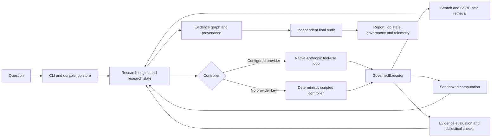

# ODAR — governed agentic research engine

ODAR is a Python research engine that turns a question into a traceable research run. It addresses a reliability problem in agentic research: a model can propose what to investigate, but it should not decide whether a network request, sandbox execution, evidence judgment, budget use, or final claim is allowed. ODAR places those decisions behind a governed execution boundary and records the evidence and audit trail.

ODAR can use a native Anthropic Messages tool-use controller when configured with `ANTHROPIC_API_KEY`, or a deterministic scripted controller when no provider key is configured. Hosted-model use may incur provider charges; the no-key controller avoids model API use, but web retrieval can still use the network.

> The implementation and its verification boundaries are documented in [Architecture](docs/ARCHITECTURE.md), [Security](docs/SECURITY.md), [Operations](docs/OPERATIONS.md), and the [Production Readiness audit](docs/PRODUCTION_READINESS.md). That audit distinguishes verified, partially verified, implemented, and out-of-scope items; it is not a blanket production certification.

## Screenshots

The web app (`odar serve`) is one continuous chat: answers stream in with inline citations, a trust score, and source cards you can open to check the quoted passage.

<p>
  
  
  
  
</p>


More views, and before/after comparisons of the redesign, are in [docs/WEB.md](docs/WEB.md#screenshots).

## How a research run works

The research loop is stateful rather than a fixed sequence. The controller proposes an action from a bounded vocabulary; the engine routes side effects through `GovernedExecutor`, which checks permissions, budgets, cancellation, retry policy, and security rules before execution. The state is checkpointed as the run progresses. New evidence can trigger claim re-evaluation; contradictions are examined before synthesis; the independent final auditor checks the result and its citations.



## Evidence, provenance, and security

Evidence items retain source and retrieval metadata, claim/evidence relations, evaluator information, and provenance. Citation auditing checks that claims are supported by recorded evidence and blocks circular self-support. Heuristic lexical evaluation is provisional and cannot certify a claim; runs can abstain when evidence is insufficient.

Retrieved pages are treated as untrusted data. The implementation includes prompt-injection scanning and quarantine, URL and redirect validation, connection pinning, bounded fetches, classified retries, redacted telemetry, and budget/cancellation controls. The sandbox uses an AST policy gate, POSIX resource limits, a temporary workspace, and process-tree timeouts; it is **process-level isolation, not a VM or container boundary**. Application-layer SSRF checks are not sufficient by themselves: deployments should also apply network egress restrictions such as the example in [`deploy/network-policy.yaml`](deploy/network-policy.yaml). See [Security](docs/SECURITY.md) for scope and limitations.

## Requirements and installation

The package metadata declares Python `>=3.10`. The checked-in dependency locks and CI verification target Python 3.13; other Python versions are not covered by the current lock-based verification. The CPU-only PyTorch wheel is installed separately, as described by the lockfile policy.

For a production-style local install from the pinned production set:

```bash
python3 -m pip install torch==2.14.1 --index-url https://download.pytorch.org/whl/cpu
python3 -m pip install -r requirements/prod.lock.txt
python3 -m pip install -e . --no-deps
```

For development and tests, use the development lock instead of the production lock:

```bash
python3 -m pip install torch==2.14.1 --index-url https://download.pytorch.org/whl/cpu
python3 -m pip install -r requirements/dev.lock.txt
python3 -m pip install -e . --no-deps
```

`requirements/prod.lock.txt` governs the runtime dependency set; `requirements/dev.lock.txt` includes that set plus pinned test, lint, type-check, and audit tools. NLI model weights are fetched by model name when needed and are not stored in this repository. See [`requirements/README.md`](requirements/README.md) before regenerating pins.

## Configuration and running locally

ODAR reads configuration from environment variables; it does not require a committed `.env` file.

| Variable | Purpose |
| --- | --- |
| `ANTHROPIC_API_KEY` | Enables the Anthropic-backed controller when set; treat it as a secret. |
| `ODAR_ANTHROPIC_BASE_URL` | Optional alternate Anthropic-compatible endpoint. |
| `ODAR_DB` | Default SQLite job-store path; defaults to `odar_jobs.db`. |

Set `ANTHROPIC_API_KEY` in the local process environment or deployment secret store; never commit a populated `.env` file. The current GitHub Actions workflows use a mock provider and do not need this key. If provider-backed CI is added later, supply it through GitHub Actions Secrets to only the job that needs it.

Run a health check, then submit a research question:

```bash
python3 run_research.py health --db /tmp/odar_jobs.db
python3 run_research.py run "What is the evidence for X?" \
  --idempotency-key study-1 --timeout 300 --db /tmp/odar_jobs.db
```

Without `ANTHROPIC_API_KEY`, the CLI defaults to the scripted controller. To select a provider explicitly, set the key in the process environment and pass `--model llm`. Provider failures fail the run by default; `--llm-fallback explicit-scripted` opts into a visibly degraded scripted fallback. Job commands include `list`, `status`, `cancel`, `resume`, and `health`; reports and full evidence payloads are written under the runtime output directory `odar_output/` by default. Those generated outputs are intentionally ignored by Git.

## Tests and benchmarks

The default test command is deterministic and excludes tests marked `integration` and `e2e`:

```bash
python3 -m pytest tests/ -q
python3 -m pytest tests/security/ -q
python3 -m pytest tests/adversarial/ -q
```

Integration tests exercise the native tool-use contract against a local mock provider; opt-in cases may download a model. E2E tests can use live network services, so run them explicitly when that is acceptable:

```bash
python3 -m pytest tests/ -q -m integration
python3 -m pytest tests/ -q -m e2e
```

The benchmark corpus is deterministic and offline. It exercises evidence, citation, contradiction, abstention, injection, numeric-consistency, and deduplication scenarios. Regression thresholds are enforced by `tests/test_benchmark_gate.py`:

```bash
python3 benchmarks/runner.py
python3 -m pytest tests/test_benchmark_gate.py -q
```

CI also runs Ruff, a gated mypy check, a production dependency audit, the test suites, a health smoke test, and a Docker build. The Anthropic provider itself is not exercised by the offline/mock tests.

Results from every benchmark round (ODAR vs GPT Researcher and Duck.ai, plus the citation checker evaluation), with raw answers and scripts, are in [bench/](bench/README.md).

## Docker and deployment

The Dockerfile installs the pinned production lock, installs the CPU-only PyTorch wheel, and runs as non-root UID 10001. It expects persistent storage for the SQLite job store and generated outputs.

```bash
docker build -t odar-engine:local .
docker run --rm -v odar-data:/var/lib/odar odar-engine:local health
```

For a research run, pass required configuration through the container environment and provide persistent volumes as appropriate. Do not bake credentials into the image. The container still needs carefully restricted network egress for research retrieval. The Kubernetes network policy is an example requiring deployment-specific review of namespace, labels, DNS, and permitted destinations; it is not applied automatically by the image.

Before exposing ODAR beyond a single trusted operator, provide an external authentication and tenancy layer, set retention controls for the SQLite store and reports, and apply network-level egress restrictions. ODAR currently has no HTTP service, multi-tenant authorization, per-tenant quotas, or automatic data-retention policy.

## Project structure

```text
odar/                    Research engine, evidence, retrieval, governance, sandbox
run_research.py          CLI and persistent job lifecycle
benchmarks/              Deterministic benchmark corpus and runner
tests/                   Unit, security, adversarial, integration, and E2E tests
docs/                    Architecture, operations, security, readiness audit
requirements/            Separate production and development locks
deploy/                  Example network egress policy
.github/workflows/       CI validation
Dockerfile               Non-root production container
CONTRIBUTING.md          Development and validation guidance
```

## Current limitations and readiness

The [readiness audit](docs/PRODUCTION_READINESS.md) records implementation-specific verification evidence and explicitly scoped gaps. It is not a guarantee of production suitability for every deployment. ODAR has no HTTP service, multi-tenant authorization, per-tenant quotas, or automatic retention policy; the real Anthropic service is not exercised by the mock-provider tests. Application-layer SSRF defenses require network-level egress controls in deployment, and the sandbox is process-level rather than a VM or container. Binary/PDF parsing and sustained-load benchmarks are out of scope; live-network E2E runs depend on external service availability. The default Anthropic model is `claude-sonnet-5-5`, Anthropic's recommended replacement for the retiring `claude-sonnet-4-5`.

## Version and license

The package version in `pyproject.toml` is **3.0.0**. Uploading this workspace does not create a release tag. The project metadata selects the MIT License; see [`LICENSE`](LICENSE). Its copyright-holder and year are placeholders and should be completed by the repository owner before public distribution.
