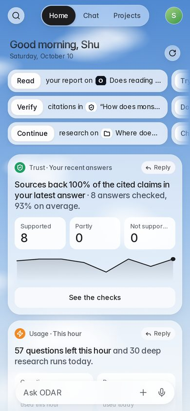
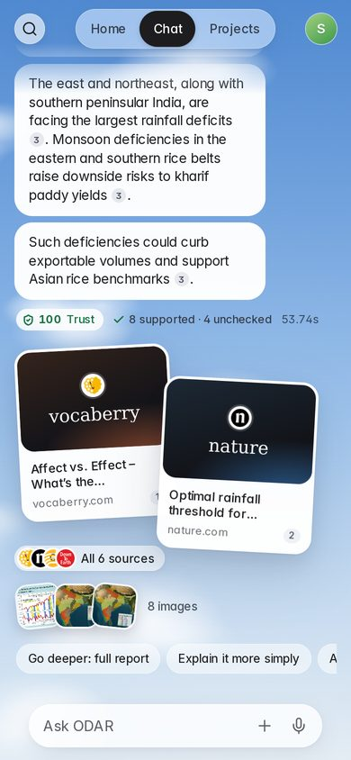
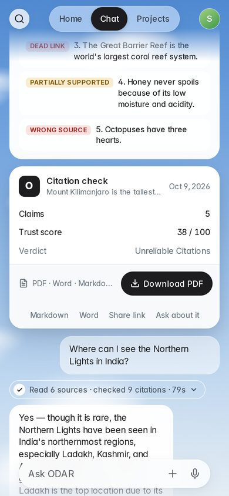
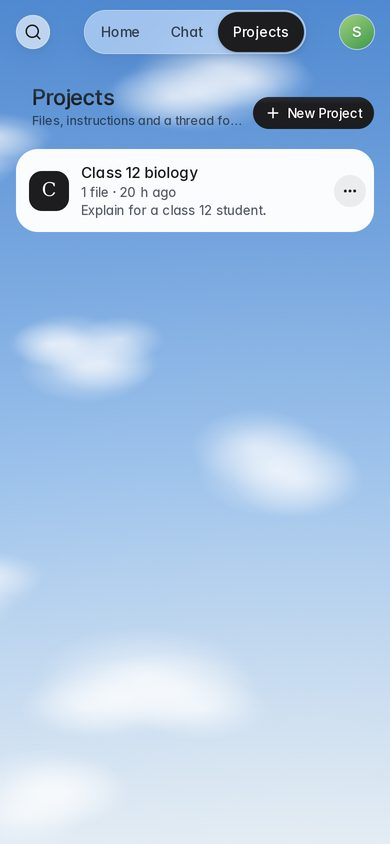
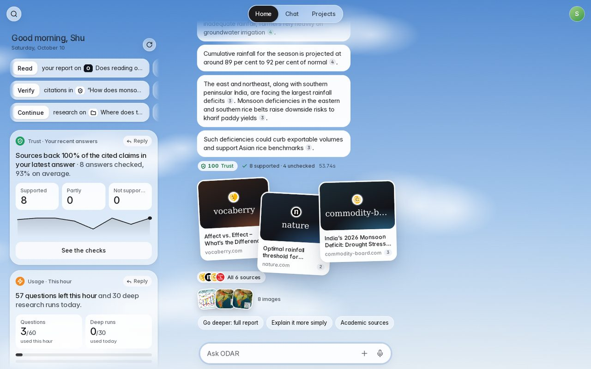
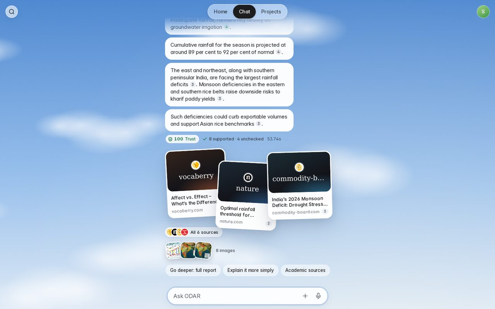
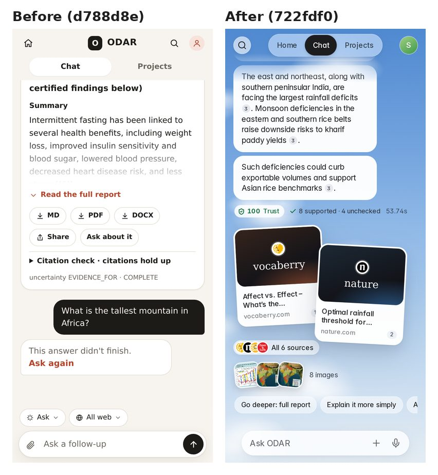
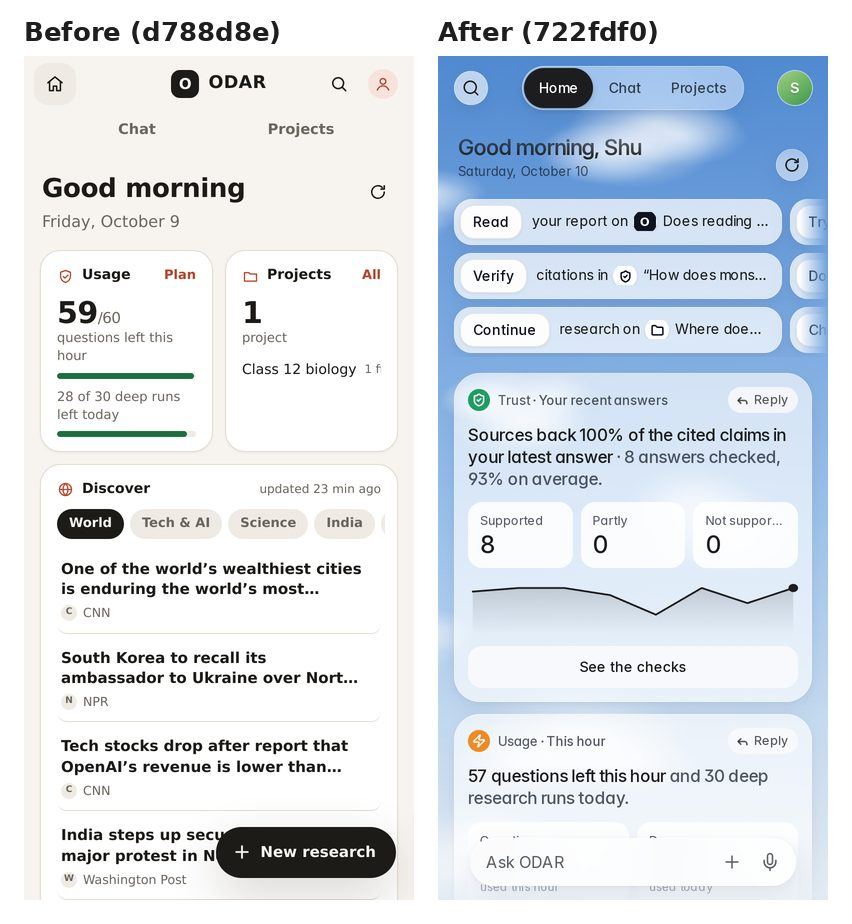

# ODAR web app

```bash
pip install -e ".[web,pdf]"
odar serve --port 8000            # http://127.0.0.1:8000
```

The app is a texting-style assistant over a **live sky**, phone first (one narrow ~500 px column on
desktop). Its look follows the Hark Pro design language, with ODAR's own name and "O" mark; the
measured spec it was matched against (colours sampled from Hark's App Store screenshots, type scale,
radii, components, motion) is in the project's `hark-research/HARK_UI_RESEARCH_v2.md`:

* **Sky**: a full-screen canvas gradient that follows the local time of day (night, dawn, day, golden
  hour, dusk) with a few soft clouds drifting slowly (`js/sky.js`). It is drawn at quarter resolution
  (~20 fps), pauses while the tab is hidden, and is a still picture under `prefers-reduced-motion`.
  Text tone follows the sky's brightness (light text at dusk and night); Settings → System preferences →
  Text colour can force Light or Dark. `?sky=dawn|day|golden|dusk|night` pins the sky for the session
  (`?sky=live` unpins), which is handy for screenshots and demos.
* **Light cards on frosted glass**: by day, assistant bubbles, link cards, receipts, page cards and
  templates are opaque white with near-black ink (`#1d1d1f`); the top-bar controls, composer, action
  cards and panels are translucent white with a heavy `backdrop-filter` blur and no borders. At dusk and
  night the bubbles and glass turn dark navy with white text. The chat fades out under the top bar (the
  view is a masked fixed scroller). Font: Inter (variable, Latin subset, SIL OFL, bundled in
  `static/fonts/`), 16 px regular for messages, system stack fallback.
* **Top bar**: a round glass **Search** button on the left; a centred segmented pill
  **Home | Chat | Projects** whose active segment is a black pill that slides between tabs; your round
  avatar (opens Settings) on the right.
* **Chat** is one continuous thread (no "new chat" list), with no avatars, names or timestamps. ODAR's
  answers arrive as **short bubbles**: one per paragraph, and a plain paragraph longer than ~300
  characters is split at sentence ends into bubbles of two or three sentences (a heading rides with its
  text; lists stay whole; tables and code get their own wide bubble; a citation chip never wraps away
  from its full stop). Your messages are translucent pills on the right. While ODAR works, a **live work
  card** in the style of Hark's Handoff card shows the pages being read as white **page cards** (site,
  serif title, text lines; the one being read is outlined) in a pale frosted container; inside it a
  white **status pill** with a dotted spinner whose one short phrase cross-fades as the work moves
  ("Searching PubMed, arXiv and Crossref", "Reading 6 sources", "Writing the answer", "Checking quotes"),
  a **Steps** pill (opens the step list and source titles) and a round **stop** button; under it a ghost
  pill names the current step and the elapsed time. When done it folds into a small ghost pill
  ("Read 6 sources · checked 9 citations · 41s") that opens the steps.
* **Composer**: a light borderless pill (inset a little from the thread on phones), "Ask ODAR", with **+** and a **mic** on the right; send appears once there
  is text, and turns into stop while an answer streams. The **+** menu holds the mode (Ask / Deep research
  / Check / References), the focus (All web, Academic, News, Discussions, YouTube; in projects: files /
  web / both), attach a file, and add to a project. Anything not default shows as a chip above the
  composer (tap it to go back to Ask or All web; research options sit there too). The mic uses the Web
  Speech API (Hindi when the app is in Hindi) and is hidden where the browser has none.
* Each answer carries: quiet inline `[n]` citation chips coloured by verdict (tap one for a sheet with
  the verified quote, URL and supported / partly supported / not supported / not checked badge); a
  **trust** badge and a "N supported · M partial" line that opens every check; **link cards**, up to
  three white cards fanned at -3° / +3° with a white edge (image when the page's site has one in the
  image results, otherwise a dark title tile in the site's hue with its name in a serif, then title and
  site; tap opens the page) plus "All N sources" for the full
  list (its sheet ends with a copyable **Cite these sources** text template); a fanned **photo** stack;
  and **follow-up chips** (full report, simpler, academic, latest news,
  Hindi).
* **Deep research, Check and References** runs started from the composer appear in the thread as the same
  live work card (pages being read as tiles, steps, status phrase from the run's newest event; expand
  opens the full run view, the other button minimises the card; runs cannot be stopped from the UI), then
  a done pill, a black **clock label** ("Open deep research", like Hark's scheduled-task label, linking
  to the full run view), a white **summary card** (report collapsed with "Read the full report", trust
  badge, citation-check details; a References run's bibliography is a copyable text template) and a
  white **receipt card** in the style of Hark's order card (line items with values on the right, then a
  footer band with the formats on the left and a black **Download PDF** pill on the right; Markdown,
  Word, Share link and "Ask about it" underneath). Fenced code in answers renders as a **code card** with
  Copy.
* **Home** (Home tab): **Action Cards**, frosted rounded cards whose verb is an embedded white button, built
  from your real data: "Read your report on …", "Follow your deep research on …" (while one runs),
  "Verify citations in …" (opens the checks of your latest answer), "Continue research on …", "Try
  today's Discover: …", "Download your latest report as PDF", "Check an AI answer for fake citations".
  They sit in three rows that scroll sideways. Then glass **Panels**: Trust (latest answer's supported /
  partly / not supported tiles and a sparkline of trust scores across answers), Usage (questions and deep
  runs left with thin bars), Discover (topic tabs, the top story as the big line, a list with
  thumbnails), Activity (questions and runs per day, last 7 days), Reports (thumbnails list, download the
  latest PDF) and Projects. Each panel has a grey "● Title · Subtitle" header (a coloured circle icon),
  one big insight sentence (black lead, grey continuation), white tiles, thick bars, a near-white
  full-width button at the bottom, and **Reply**, which drops a prompt about it
  into the composer. On screens 1180 px and wider, Home opens as a **left column next to the chat**; on phones it is its own page with the composer (what you type there is asked
  in Chat). Pull down to refresh.
* **Projects** tab: a plain "Projects" heading with a black **+ New Project** pill; create, rename, delete; each project opens its own thread (the latest one continues;
  "New thread" starts fresh) with a **Files** sheet for uploads and custom instructions.
* **Search** (top-left button, or Ctrl/Cmd-K): searches project names and instructions, thread titles,
  the messages of your 25 most recent threads and report titles in the browser, grouped as Projects,
  Chats, Reports and Messages.
* **Settings** sheet (avatar, or `/settings`), in Hark's order where ODAR has the thing: **Billing** (plan
  and usage meters), **Profile** (name, stored in this browser only), **Connected apps** (API keys),
  **System preferences** (language English / हिंदी: app labels, and deep reports default to Hindi; text
  colour Auto / Light / Dark), **Security** (privacy, run history, delete everything), **Feedback** (opens
  the GitHub issues page), **About**, **Sign out** (a placeholder: there are no accounts yet; data is tied
  to this browser). Hark's Scheduled tasks and Wallets rows are left out because ODAR has neither.
* **Tabs stay mounted.** Home, Chat and Projects each keep their own pane inside the scroller; switching
  tabs hides one and shows the other with its scroll position, without rebuilding or refetching (Home
  quietly refreshes its data when it is over a minute old, Projects rebuilds after two minutes or after
  you open a project). Thread, project-thread, run and shared pages reuse the Chat pane, so there is only
  one thread on the page. A stream still running when you leave Chat is stopped as before.
* **Details:** one icon set (Lucide geometry, 24 viewBox, a 1.5 px stroke that stays 1.5 px at every
  size); real site icons on link cards, source tiles, the "All N sources" stack and work-card tiles
  (Google's favicon service at 64 px, then the site's `/favicon.ico`, then a monogram in the site's
  hue); link cards use the page's own image when the backend sends one. The avatar is a monogram on a
  gradient whose hue comes from your name. Empty states for chat, projects and search; a 2 px focus
  ring; quiet hover lifts and thin scrollbars where there is a mouse; 44 px minimum touch targets; an
  inverted toast pill; a composer with an inner highlight, a soft focus glow and a mic that morphs into
  the send arrow. The scroller's bottom padding follows the composer's measured height, so the last card
  on Home clears it on phones.
* Respects `prefers-reduced-motion` and safe-area insets. Plain HTML/CSS and ES modules in
  `odar/web/static/` (`app.js` plus `js/*.js`: `core`, `sky`, `chat`, `work`, `runs`, `home`, `projects`,
  `search`, `profile`, `md`), no build step and no CDN.

Older links keep working: `/c/<thread>`, `/p/<project>`, `/runs/<id>`, `/r/<token>` (shared report),
`/s/<token>` (shared thread), `/history`, `/settings` (opens the profile sheet), `/new?mode=research`.

### Ask

* **Focus** (one per question): All web · Academic (Crossref, PubMed, arXiv, OpenAlex, Semantic Scholar
  abstracts) · News (ddgs news, dates shown) · Discussions (`site:reddit.com` plus forums, labelled
  "forum") · YouTube (video titles and descriptions only; pages are not fetched).
* Pipeline: ddgs search (~6 results, backend fallback yahoo → auto → bing → duckduckgo) → SSRF-guarded
  fetch of the top pages (`PageExtractor`, 15 s phase cap) → one streamed answer on the free routes
  (only `:free` models are ever used here) → verification of each cited sentence (≤14 checks, 50 s cap).
* **Threads**: Research / Check / References cards in a thread are not used as chat context. Follow-ups keep context (last 3 Q&A turns, trimmed to 3,000 chars, plus their source
  titles; short follow-ups borrow the previous question's terms for search). Rename, delete, share
  (`/s/<token>`, read-only, `noindex`).
* **Projects**: name + custom instructions + files (PDF/DOCX/TXT/MD, 10 MB each, max 20 per project, via
  `inputs.py`). Files are chunked (~900 chars) and searched locally with BM25 (no embeddings, no network).
  Questions inside a project use **My files**, **Web**, or **Both**; file citations show the file name and
  passage. Unlike Check uploads, project file *text* is stored (in SQLite) until you delete the file or
  project.
* **Images**: ddgs images, shown as a strip with source links. The server never fetches image bytes; only
  https thumbnails that pass the SSRF URL policy are returned, and the browser loads them directly with
  `referrerpolicy="no-referrer"`.
* **Discover**: World, Tech & AI, Science, India, Business headlines from ddgs news, cached in SQLite
  for 3 hours (`ODAR_DISCOVER_TTL_S`). No LLM summaries are made up front; tapping a story starts an
  Ask thread (News focus) about it.

Modes: **Research** (deep cited report, optional per-claim citation check), **Check** (verify an AI
answer's citations, with quotes, source-quality labels, freshness and confidence), **References**
(validate a bibliography against Crossref / PubMed / arXiv / OpenAlex, flag fake or mismatched
references, suggest real papers, format APA / MLA / Chicago / IEEE).

Inputs: paste, PDF/DOCX/TXT/MD upload (10 MB), article URL, Google Doc shared as "anyone with the link".
Outputs: share link, Markdown / DOCX / PDF export, follow-up questions answered only from the report.
Hindi: Hindi input is checked via an English translation; reports can be written in Hindi.

Not offered on purpose: plagiarism detection, writing essays or assignments.

## API

Create a key in the app (**API & privacy**) and send `Authorization: Bearer odar_...`.

| Endpoint | Purpose |
|---|---|
| `POST /api/runs` (form: mode, text/url/file, style, language, academic, verify, thread_id) | start a run; `thread_id` (an owned thread, or `new`) also shows it in that chat thread as a request bubble plus a run card, and the response carries `thread_id` |
| `GET /api/runs/{id}?after=N` | status, stage, new progress events, result |
| `POST /api/runs/{id}/ask` `{"question": ...}` | follow-up grounded in the report |
| `GET /api/runs/{id}/export.{md,docx,pdf}` | download |
| `GET /api/share/{token}` | public read-only report |
| `GET /api/limits` | remaining quota |
| `POST /api/ask/stream` `{"question", "focus", "thread_id", "project_id", "sources", "images", "verify"}` | SSE: `thread`, `sources`, `images`, `delta`…, `done`, `verification` (or `error`) |
| `GET /api/ask/stream?q=...&focus=...` | same, for `EventSource` |
| `POST /api/ask` | same pipeline, one JSON object |
| `GET /api/threads?project_id=` · `GET/PATCH/DELETE /api/threads/{id}` | threads (owner only); `GET` returns the latest `limit` messages (default 200, max 500), oldest first |
| `GET /api/shared-threads/{token}` | public read-only thread |
| `POST/GET /api/projects` · `GET/PATCH/DELETE /api/projects/{id}` | projects |
| `POST /api/projects/{id}/files` (multipart `file`) · `DELETE .../files/{file_id}` | project files |
| `GET /api/images?q=` | image results (thumbnail, image, source page) |
| `GET /api/discover?topic=all\|world\|tech\|science\|india\|business` | cached headlines |

`focus`: `all`, `academic`, `news`, `reddit`, `youtube`. `sources` (projects only): `web`, `files`, `both`.
The `verification` event lists one entry per marker occurrence in reading order:
`{occ, n, claim, verdict: supported|partial|unsupported|unchecked, check_verdict, quote, note, title, domain, url}`.

OpenAPI docs: `/api/docs`.

## Limits and privacy (env vars)

`ODAR_IP_RUNS_PER_HOUR` 10 · `ODAR_IP_RUNS_PER_DAY` 30 · `ODAR_KEY_DAILY_LIMIT` 50 ·
`ODAR_FOLLOWUPS_PER_HOUR` 30 · `ODAR_ASK_PER_HOUR` 60 (Ask has its own, lighter budget per network or key;
images use twice that) · `ODAR_RETENTION_DAYS` 30 · `ODAR_TRUST_PROXY=1` behind a proxy ·
max 2 active runs per user. Uploads are never stored; checked text only when "Keep" is ticked;
share links send `X-Robots-Tag: noindex`; threads older than the retention period are deleted;
`DELETE /api/me` removes all runs, threads, projects (with their files) and keys.
Scholarly API answers are cached for 7 days in SQLite. `ODAR_OPENALEX_KEY` (free) and
`ODAR_CONTACT_EMAIL` improve OpenAlex/Crossref access.

## Models

Free `:free` routes with automatic fallback (`odar/router.py`): deepseek-v4-flash, mimo-v2.5,
mimo-v2.6-flash. Override per role with `ODAR_MODEL_ROUTES` JSON. Without a model key, Check still
runs fully local (NLI only).

## Free hosting

Vercel can't run the backend: the local NLI model needs PyTorch (too large and slow for
serverless). Use the Dockerfile on **Hugging Face Spaces** (free CPU, 16 GB RAM) with
`CMD odar serve --host 0.0.0.0 --port 7860`. Render's free tier (512 MB) is too small for NLI.
A live check takes about 2 to 7 minutes on free models; references take under a minute.
An Ask answer takes about 10 to 25 s on free models (sandbox smoke test 2026-10-07: search 0.7 s, answer
done at 10.3 s, verification of 10 cited sentences 44 s more). Token Harbor delivered the answer as one
burst, so "time to first token" is close to the full answer time; the UI shows a typing indicator.

## Chrome extension

See `extension/README.md`: right-click selected text → Check citations with ODAR.

## Screenshots

Captured with Playwright against a local `odar serve` (390x844 phone at 2x, 1440x900 desktop).

| Home | Chat | Citation receipt | Projects |
|---|---|---|---|
|  |  |  |  |





### Before and after the redesign

First texting-style frontend (d788d8e) next to the current one after the clarity, smoothness and detailing passes (722fdf0).




